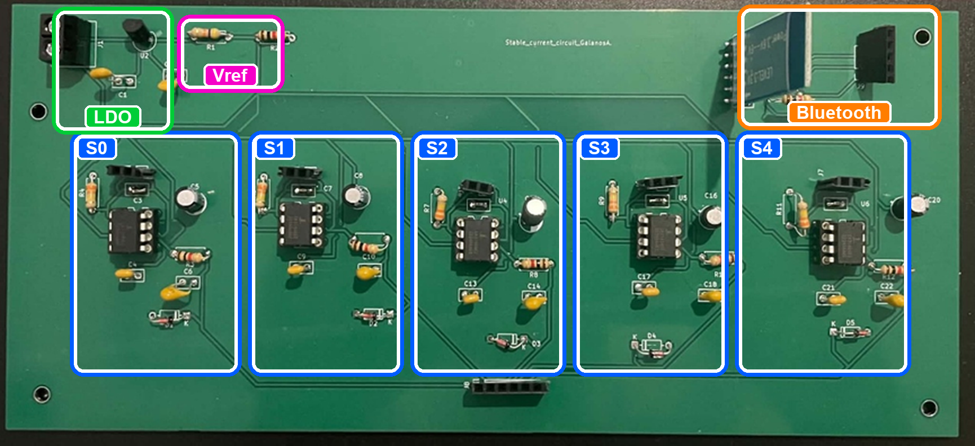
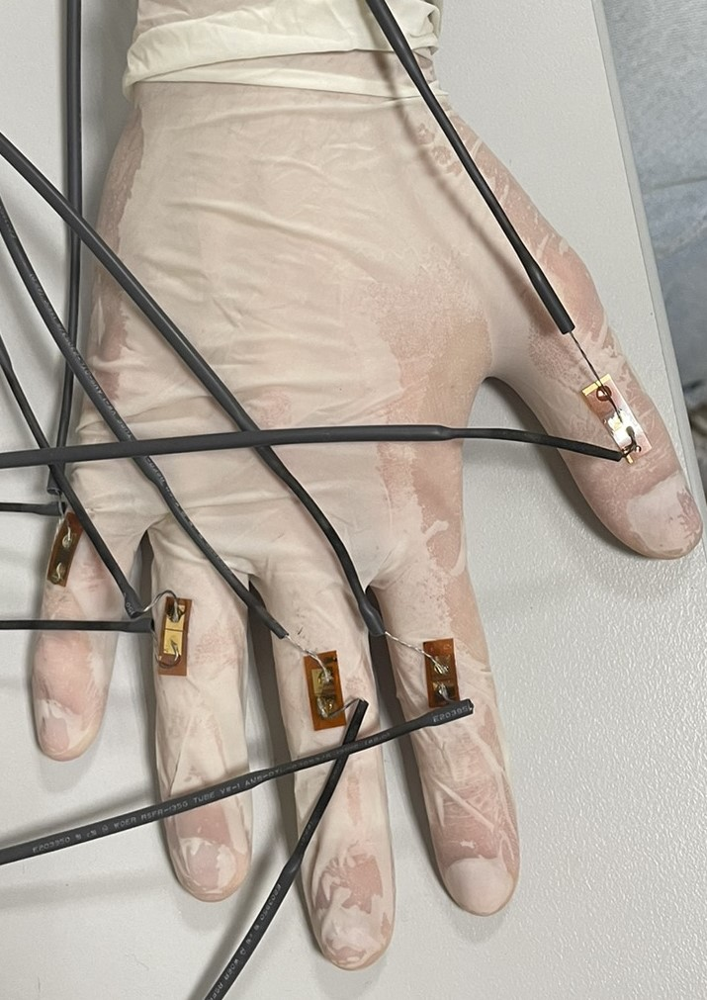
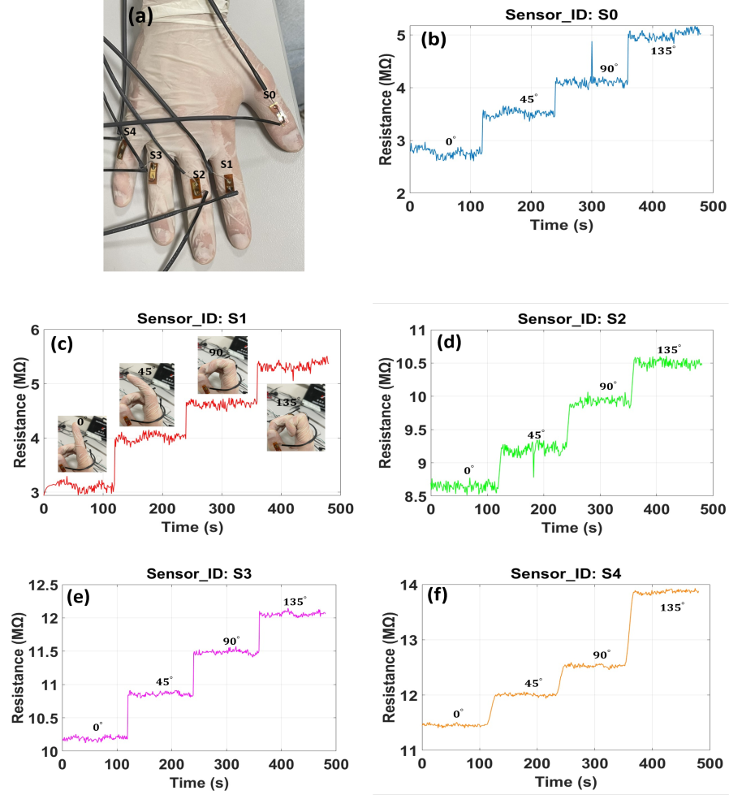

# Smart Glove Strain Sensor System

A compact smart-glove project for measuring finger bending with five piezoresistive strain sensors. The system combines a custom constant-current analog front end, Arduino data acquisition and a simple Python interface for viewing and saving measurements.



## Project overview

- Five strain-sensor channels connected to Arduino analog inputs A0-A4.
- Constant-current readout designed for sensors in the megaohm range.
- Resistance calculation, trimmed-mean sampling and IIR filtering on the Arduino.
- Serial data transmission at 115200 baud.
- Python desktop interface for live plotting and measurement logging.

## Files

| File | Description |
|---|---|
| [`stable_current_5sensors.ino`](stable_current_5sensors.ino) | Arduino firmware for reading and filtering five strain sensors. |
| [`gui_script_v2.py`](gui_script_v2.py) | Tkinter interface for serial measurements, live plotting and data logging. |
| [`images/`](images/) | Photos of the prototype and representative sensor measurements. |

## Hardware

The custom board contains five independent sensor-readout channels, a voltage reference, voltage regulation and Bluetooth connectivity.



## Sensor response

The sensors produce a clear resistance change as the fingers bend from 0° to 135°.



## Basic use

1. Open `stable_current_5sensors.ino` in the Arduino IDE.
2. Check the calibration constants `RSET_OHMS`, `VNODE_VOLTS` and `ADC_REF_VOLTS` for the specific board.
3. Upload the firmware to the Arduino and open the serial connection at 115200 baud.
4. Install the Python dependencies:

   ```bash
   pip install pyserial matplotlib
   ```

5. Start the desktop interface:

   ```bash
   python gui_script_v2.py
   ```

> **Note:** The Python interface is included in its original single-channel logging form. The Arduino file outputs five sensor channels, so the serial-field selection in the Python parser must be adapted when using the two files together.

## Related publication

The complete smart-glove system is described in the following preprint:

[A High-Fidelity Bluetooth-Enabled Smart Glove Using Platinum Nanoparticle-Based Strain Sensors and Machine Learning for Object Recognition](https://papers.ssrn.com/sol3/papers.cfm?abstract_id=7134952)
