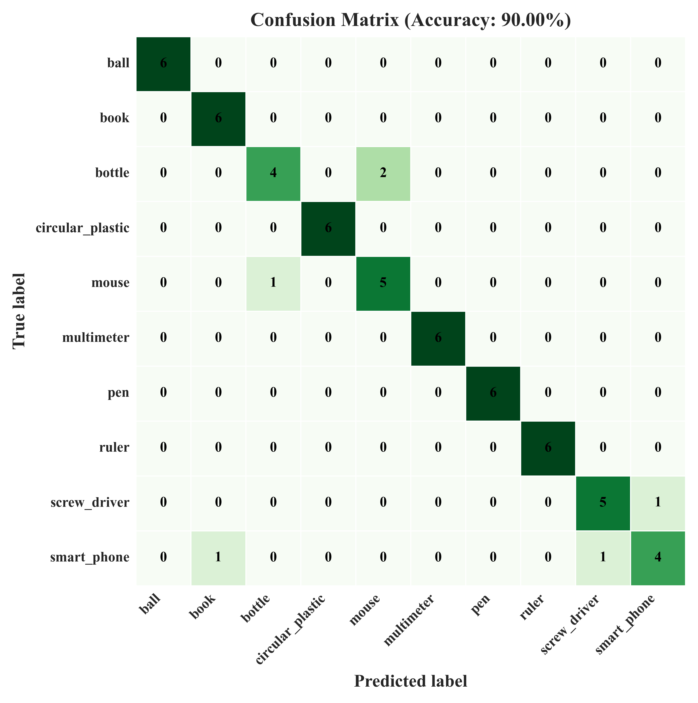
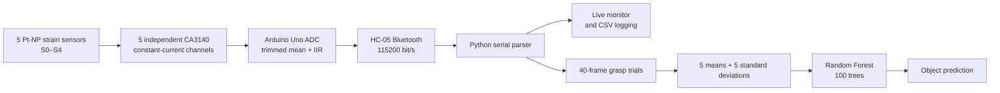

# Pt-Nanoparticle Smart Glove

An end-to-end wearable sensing system that combines five piezoresistive Pt-nanoparticle strain sensors, a custom low-current analog front end, Bluetooth telemetry, synchronized data acquisition, and machine-learning-based object recognition.

<p align="center">
  
</p>

<p align="center">
  
  &nbsp;&nbsp;
  
</p>

## Why this project

High-resistance wearable sensors are difficult to read accurately without adding noise, self-heating, channel crosstalk, or excessive hardware complexity. This project addresses that problem with a dedicated readout channel for every finger and a compact machine-learning pipeline built around clean static grasp signals.

The system was developed as part of an MSc project in Microsystems and Nanodevices and brings together sensor characterization, analog design, PCB development, embedded acquisition, desktop software, signal processing, and object recognition.

## System overview



## Highlights

- Five independent sensing channels avoid analog multiplexing and its associated switching noise and crosstalk.
- Approximately 315 nA sensor excitation is optimized for high-resistance sensing while limiting self-heating.
- The custom PCB integrates the voltage regulator, reference network, five analog channels, Arduino interface, and Bluetooth connection.
- Firmware performs per-channel calibration, trimmed-mean sampling, status checks, and IIR filtering at 20 Hz.
- The desktop monitor plots all five filtered channels and records synchronized CSV measurements.
- The included dataset contains 300 static-grasp trials: 10 everyday objects, 30 trials per object, and 40 frames per trial.
- Mean and standard-deviation features produce a compact 10-element representation for a 100-tree Random Forest.
- The reported single-user evaluation achieved 90% classification accuracy across 10 objects.

## Reported validation results

| Layer | Result |
|---|---:|
| Sensor gauge factor | 72.97 |
| Sensor response / recovery | ~49 ms / ~56 ms |
| Hysteresis error | ~6.78% |
| Fatigue evaluation | 10,000 bending cycles |
| Mean AFE readout accuracy | 98.92% |
| Unshielded AFE noise floor | ~4–5 ADC LSB peak-to-peak |
| End-to-end SNR | 33.0 dB average |
| Object-recognition accuracy | 90% across 10 classes |

These results describe the investigated prototype and acquisition protocol. Object-recognition performance is based primarily on one participant and should not be interpreted as person-independent performance; see [Dataset and evaluation](docs/ml_pipeline.md).

## Repository map

| Path | Contents |
|---|---|
| `firmware/` | Arduino firmware for the five-channel constant-current PCB |
| `hardware/kicad/` | KiCad 10 schematic, PCB layout, and project file |
| `hardware/schematic/` | Exported circuit schematic |
| `hardware/BOM.md` | Component summary derived from the KiCad schematic |
| `software/` | Serial protocol and five-channel live monitor |
| `software/legacy/` | Original single-channel GUI retained for traceability |
| `ml/` | Dataset capture, feature extraction, training, and real-time inference |
| `data/object_recognition/` | Ten labeled CSV files used for object recognition |
| `results/` | Representative glove-response and classification figures |
| `docs/` | Hardware, protocol, ML, and reproducibility notes |
| `tests/` | Parser and feature-extraction tests |

## Quick start

### 1. Install the host software

Python 3.10 or newer is recommended.

```bash
python -m venv .venv
# Windows
.venv\Scripts\activate
python -m pip install -e .
```

### 2. Upload the firmware

Open `firmware/stable_current_5sensors/stable_current_5sensors.ino` in the Arduino IDE, verify the measured constants for your board, select an Arduino Uno, and upload it.

The committed configuration streams at 20 Hz. Pairing the HC-05 creates a serial port on the host computer; USB serial can also be used during bench testing.

### 3. Monitor and log all five channels

```bash
smart-glove-monitor
```

Select the serial port, choose an output CSV, and press **Start**.

### 4. Train the object classifier

```bash
smart-glove-train
```

The command loads the included dataset, performs a stratified 80/20 evaluation and five-fold cross-validation, saves a model under `models/`, and writes generated metrics and a confusion matrix under `results/generated/`.

### 5. Run real-time inference

```bash
smart-glove-infer --port COM4
```

Replace `COM4` with the serial port assigned to the Arduino or HC-05.

## Calibration note

The values in `RSET_OHMS`, `VNODE_VOLTS`, and `ADC_REF_VOLTS` are measured prototype-specific constants. Re-measure them before using a different PCB or microcontroller. The resistance estimate for each channel is

```text
Iset = Vnode / Rset
Rs   = (Vout - Vnode) / Iset
```

Detailed hardware and protocol notes are available in [docs/hardware.md](docs/hardware.md) and [docs/serial_protocol.md](docs/serial_protocol.md).

## Preprint

The system is described in the preprint:

> A. Galanos, P. Bousoulas, C. Tsioustas, and D. Tsoukalas, “A High-Fidelity Bluetooth-Enabled Smart Glove Using Platinum Nanoparticle-Based Strain Sensors and Machine Learning for Object Recognition,” 2026.

[View the preprint on SSRN](https://papers.ssrn.com/sol3/papers.cfm?abstract_id=7134952)

If this repository supports your work, please use the metadata in [`CITATION.cff`](CITATION.cff).

## Scope and licensing

This repository contains selected implementation files, a de-identified sensor dataset, and representative results. Draft manuscripts, reviewer correspondence, temporary exports, backups, and unrelated laboratory data are intentionally excluded.

Copyright © 2026 Angelos Galanos. All rights reserved. See [`LICENSE`](LICENSE).
